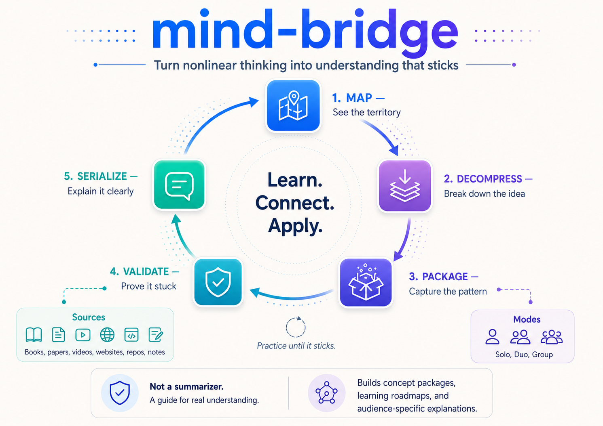

# mind-bridge

**Understand something well enough to explain it simply. And make sure it actually sticks.**

mind-bridge is a skill you can use in any AI assistant that supports skills. You bring something you want to understand: a subject you're studying, a language you're learning, a long book you don't have time to read in full, a topic you're just curious about, or a hunch you can't put into words. It walks you through understanding it for real, then checks that it stuck.

It works the same whether you're studying for an exam, picking up a new field on your own, learning a language, or getting ready for work.

---

## What it's for

Two everyday situations.

**You understand something, but it comes out wrong.** The picture is clear in your head. You start explaining, and it turns into a mess. The other person nods, but you can tell they didn't get it. The problem usually isn't your understanding. It's the jump from a clear picture in your head to words that come out one at a time.

**You read something long, and a month later it's gone.** A thick book, a dense paper, a two-hour lecture. You finished it. Now you'd struggle to say what was in it. Reading every page in order was never the point. You wanted to use a few specific things from it.

mind-bridge is built for both.

---

## How it works

It doesn't summarize things for you. It isn't a place to look up definitions. Think of it as a patient guide for understanding something the right way.

Say you want to learn an idea. It won't open with a textbook definition. First it takes the idea apart. What problem does it solve? What goes wrong without it? How does it actually work? Then it asks you to build your own example, and it hunts for the cases where the idea breaks down. Knowing where something stops working is part of knowing it.

Then it tests whether any of it stuck. Most learning skips this step. It asks you to explain the idea back in your own words, give a fresh example, and use it on a case you haven't seen. If something is missing, it tells you exactly what. "You've got the idea, but not the mechanism." It gives you a score and a small exercise to close the gap. Feeling like you understood something is not the same as being able to use it. The skill is built to tell the two apart.

And it doesn't stop at one round. You keep going: more exercises, a sharper explanation, another test, until the idea is locked in and not just familiar.

It can also rewrite an idea for whoever you need to reach. A thirty-second version to tell a friend. A simpler one for someone just starting out. A sharper one for someone who already knows the basics.

At the end you get a **concept package**: a short, plain summary of the idea that you can keep and reread. The next section shows one.

---

## What a concept package looks like

A concept package is what stays in your head a week later, once you really understand something. It always has the same parts, so nothing important slips through. Here is one for an idea most people already know:

> **Diminishing returns**
>
> - **The idea:** past a point, each extra hour of effort buys less than the hour before it.
> - **The problem it solves:** you keep pouring time into something long after it stopped paying off.
> - **How it works:** the cheap, high-impact gains get used up first, so what's left costs more and gives back less.
> - **An example:** studying for an exam. The first three hours move your grade a lot. The tenth barely moves it.
> - **Where it breaks:** when effort compounds. An instrument pays off slowly at first, then more and more.
> - **When to use it:** deciding whether "good enough" is actually enough, so you can stop.
> - **In 30 seconds:** "Effort and results aren't a straight trade. Early effort pays off big, later effort pays off less. The trick is noticing when you've crossed into the 'less' part, and stopping."

Notice the "where it breaks" line. Knowing where an idea stops applying is often how you find out whether you really understand it.

The package is the start, not the finish. With it in hand you can keep practicing: run exercises, try new examples, and ask the skill to test you again, until the idea really sticks.

---

## Bring it almost any source

It takes much more than a book. Hand it almost anything. It sizes up how big the source is and gives back the right thing: a package or two for something short, a full roadmap for something big.

- **A meeting or class.** *"Here are the notes from today's class. Pull out what I should actually study."*
- **A video or talk.** *"Here's a link to a 40-minute talk. Turn it into the few ideas worth keeping."*
- **A blog post or article.** *"Turn this article into something I'll still remember next week."*
- **A link or web page.** *"Read this page and package the main idea."*
- **A paper or report.** *"Break this paper down so I can follow the argument."*
- **A book or a long document.** *"Turn this book into a learning plan."*
- **Your own messy notes.** *"Here's a pile of notes I took. Help me find the real idea in them."*

For anything big, it builds a step-by-step learning roadmap. That's the next section.

---

## Learning from a long book or course

When what you want to learn is large, a textbook, a dense paper, a whole course, mind-bridge doesn't try to teach it all at once. It reads the whole thing first and lays out a plan:

- The **main idea** of the source, in a line or two.
- An **ordered list of concept packages**, each one a piece you can learn on its own. They're numbered P1, P2, P3, and so on.
- For each package, a short note on what to read closely, what to skim, and what to skip.

When the plan is large, it doesn't start teaching right away. It hands you the plan, suggests saving it, and recommends learning one package at a time, each in its own session. The workflow below shows how.

### A workflow that works well

Each package sticks better when you give it room. A simple way to do that:

1. **First session: build the plan.** Ask for the roadmap. You get the main idea and the ordered list of packages.
2. **Save it.** Ask mind-bridge to write the roadmap to a `.md` file, or export it as a PDF. Keep it somewhere easy to find.
3. **One package per session.** Open a fresh session, attach the saved roadmap, and say `open P4` (or just "let's do P4"). The skill picks up that one package and teaches it.
4. **Practice until it sticks.** In that session, do the exercises, give your own examples, and ask it to test you. Move on only when the package is solid.
5. **Next session, next package.** Repeat with P5, P6, and on down the list.

A fresh session per package keeps each one focused and easier to remember. When you want to go further with a package, you can also ask for `validate P2`, `serialize P1 for a meeting`, or `expand P7`.

---

## What you can ask it to do

You don't pick a mode. mind-bridge reads what you ask and chooses for you. Here is the full menu, in plain terms, with an example of each.

**Understand something new**

- **Learn a concept.** Teaches you something from the ground up, the way described above. *"Teach me the basics of music theory so I understand what I'm playing."*
- **Name a hunch.** You have a gut feeling you can't put into words. It asks a few sharp questions and helps you name it. *"I have a hunch I can't explain: the more choices a menu gives me, the less I enjoy choosing."*
- **Find the word.** You know the idea but not its name. It helps you land on the term. *"What's the word for when a small early advantage keeps growing on its own?"*

**Work with something you already get**

- **Package it.** Turn an idea you already understand into a clean, reusable summary. *"Package what I understand about how photosynthesis works."*
- **Go deeper.** Open up one piece when you need to really get into it. *"Go deeper on the part I'm still shaky on."*

**Check it and keep it**

- **Test yourself.** Exercises and a score that show whether it really stuck, and what's still missing. *"Test whether I really understand this before my exam."*
- **Save your work.** Keep your packages in one place and list them later. *"Save this to my library."*

**Explain it to other people**

- **Reshape it for an audience.** A version for a child, a thirty-second one for a study group, a clear one for a friend who asked. *"Give me a version simple enough to teach my little brother."*
- **Prep to present or discuss.** Get ready for a class presentation, an interview, or a meeting. *"Help me get ready to present this in class tomorrow."*

**Take on something big**

- **A long source.** A book, paper, video, lecture, transcript, or link becomes packages and a roadmap you can work through. *"Turn this into a learning plan."*

**Improve how you use it**

- **Review your habits.** Look back at how you've been using the skill and where to adjust. *"Review how I'm using this."*

Working with other people, two of you or a small team, has its own setup. That's the next section.

### A note on levels

When it teaches or tests you, it thinks about how well you know something, on a simple ladder: you can **recognize** it, **explain** it, **apply** it, **implement** it, or **teach** it. That's why it might say "you can explain this, but you couldn't put it into practice yet." It tells you where you actually are, instead of letting a good feeling pass for real understanding.

---

## Three ways to use it

| Setup | Good for |
|---|---|
| **Solo**, on your own | Studying a subject, learning a language, picking up a new field on your own, getting through a long book, naming a fuzzy hunch, prepping to present |
| **Duo**, two people | A study pair, two friends, or two colleagues getting on the same page before a test or a decision |
| **Group**, 3 to 5 people | A study group, a reading club, or a team getting aligned, with turns so the loudest person doesn't decide the answer by default |

For bigger groups, it splits you into small pods and merges the results.

---

## Try it

With mind-bridge installed, try one of these.

> I'm learning Spanish and I keep mixing up "ser" and "estar." Help me actually understand the difference, not just memorize a rule.

> I'm studying for a biology exam. Turn this chapter on cell division into a study plan, then test me on it.

> Teach me the basics of how the immune system works. I'm starting from zero and just want to get it.

> I have a hunch I can't put into words: the more choices a menu gives me, the less I enjoy choosing. Help me name it and check whether it holds up.

> A friend and I keep landing in different places on the same topic. Help us get to a shared understanding of it.

---

## What it's NOT

A few things it stays away from on purpose:

- **Not a summarizer.** It works on your understanding. It doesn't shrink text.
- **Not a definitions lookup.** If you just want "what is X?", ask your assistant directly. That's faster.
- **Not a shortcut past practice.** A clear write-up of an idea is not the same as being able to do it.
- **Not a replacement for primary sources** when precision really matters: legal, medical, scientific, regulatory.
- **Not a promise of mastery.** It gets you to "I can explain and apply this." Putting something into real practice still takes time and real mistakes.
- **Not a persuasion tool.** It's for shared understanding, not for winning arguments against someone's own judgment.

---

## Install

Copy the `mind-bridge` folder into the skills directory of any assistant that supports skills, then open a new session. That's it.

It starts on its own when you ask for the kind of thing it's good at. You can also just say *"use mind-bridge"*.

It works in two languages. It replies in whatever language you write in, and it responds to both English and Spanish prompts.

---

## Status

mind-bridge is at **v1.3.0**: stable, and tested.

---

## Feedback

If a prompt worked, tell me what worked. If a prompt fell flat, send the prompt and what it actually gave you back. A skill like this gets better from real cases, so your examples help it improve.

---

## License

[MIT](LICENSE).
